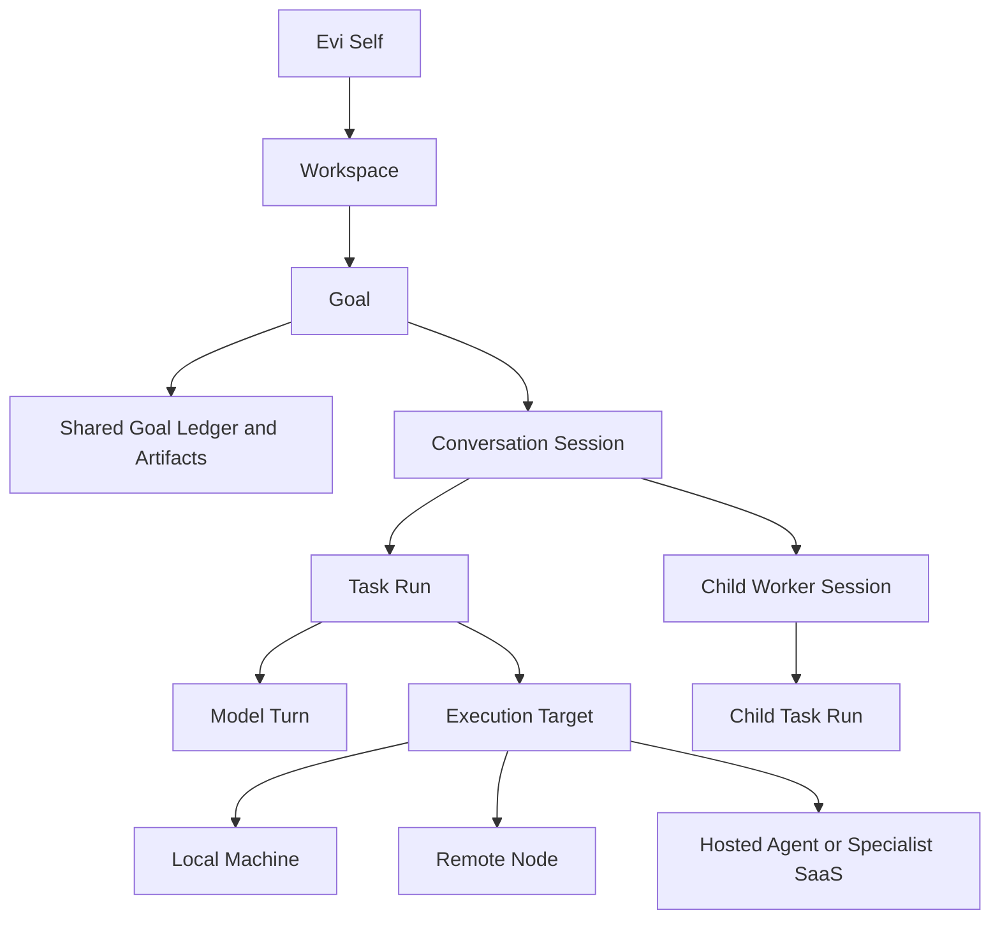

# Evi 产品与运行时愿景

状态：已接受的长期方向；不是已实现的运行时契约，也不授权立即启动本文描述的所有产品面。

本文定义：当 Evi 的自进化、自迭代基础闭环得到证明后，它长期应该发展成什么样。内容统一一个持久 Self、多个入口、按 Context 选择执行位置、多 Session 语义、Harness、Memory、委派、工具能力认知，以及 Evi 与 LuBan 的边界，但不把这些方向变成脱离当前进度的长 backlog。

英文对应文档为 [`docs/PRODUCT_VISION.md`](PRODUCT_VISION.md)。

## 效力与优先级

当本愿景与当前实现不一致时，按以下顺序判断：

1. 当前代码、[`docs/ARCHITECTURE.cn.md`](ARCHITECTURE.cn.md)、
   [`docs/RUNTIME_CONTRACT.md`](RUNTIME_CONTRACT.md) 和
   [`docs/LOCAL_RUNTIME.md`](LOCAL_RUNTIME.md) 描述当前模块归属与已经实现的行为；
   当前事实最终仍以代码和 live evidence 为准。
2. [`docs/V0.2_MULTI_NODE_EVOLUTION.cn.md`](V0.2_MULTI_NODE_EVOLUTION.cn.md) 和
   已接受 ADR 描述已经接受的当前交付目标。
3. 本文描述更长期的产品与运行时北极星。
4. 有边界 Goal、其 Decision Owner 与原生 harness 才能激活真实实施。GitHub 可承载可选的
   外部协作或交付 evidence。

本愿景本身不能证明功能已经完成，不能自动打开实施切片，也不能覆盖更窄的验收、验证、隐私或外部副作用门禁。

## 长期北极星

Evi 应发展为本地优先的通用 Agent 大脑：始终是同一个可持续成长的 Evi，能够理解长期目标、跨 Workspace 工作、学习如何高效使用工具和专业 Agent、根据任务 Context 选择执行环境、保持连续性，并用证据说明发生了什么。

它的产品形态是：**一个大脑、多个入口、多种执行环境**。Evi 可以从中央控制台、IM 中的 `@Evi`、IDE、浏览器、CLI、API、Connector 或其他宿主工具中被唤醒。这些产品面把现场 Context 绑定到同一个 Self，不会各自产生独立的 Evi 人格或状态所有者。

Evi 不是每个 Workspace 各自分裂出的不同人格。Workspace、Goal、Session 和 Run 都是围绕同一个持久 Self 建立的作用域化运行上下文。Evi 也不应变成另一个 coding CLI、无约束的 Agent 团队聊天室，或托管式多用户控制平面。

产品承诺是：

> 让同一个可信的 Evi 拥有持续目标、明确的 Context、可验证的执行、可恢复的连续性，以及受治理地学习何时、何地、如何更好使用工具和专业 Agent 的路径。

## 产品原则

1. **一个 Self，多个有界上下文。** 身份稳定；Workspace、Goal、Session 和 Node overlay 必须显式且可检查。
2. **一个逻辑大脑，多个物理入口。** Web、Desktop、IM mention、IDE、浏览器、Connector、CLI 和 API 都绑定到同一个 Evi。
3. **Self 本地优先，执行跟随 Context。** 可信本地主节点默认拥有 Self、Goal、原始 Memory 和学习判断；任务可以在本机、远程数据附近、托管 Agent 或专业 SaaS 中执行。
4. **Runtime 拥有运行事实。** 所有 UI 和宿主 Binding 都是 resident runtime 的客户端，不能成为第二个状态 owner。
5. **Context 通过编译得到，而不是无限堆积。** 每次模型调用只接收为当前目的选择的、有预算的、不可变 Context Snapshot。
6. **Harness 是运行与学习记录。** 即使本地可信环境开放较大权限，也要冻结任务、Context、环境、所选工具、预算、Outcome Contract、Evidence 和恢复预期。
7. **通信必须类型化。** Session 之间交换任务、结果、事件和 Artifact 引用，而不是复制整段 Prompt 或整个 Memory Store。
8. **Memory 不是消息总线。** 运行协作、历史检索、稳定文档和可复用能力资产分别由不同机制负责。
9. **Evi 做判断，LuBan 保存已接受资产。** 能力生命周期判断属于 Evi；LuBan 提供 canonical Git 身份和历史。
10. **证据优先于表面规模。** Session、Skill、Connector 和页面数量增加，不等于完成质量、恢复能力或真实效果提升。

## 产品形态

所有产品面统一连接一个 headless Evi Daemon/Gateway，并复用其版本化契约。

| 产品面 | 主要职责 | 硬边界 |
| --- | --- | --- |
| Evi Daemon/Gateway | 管理 Session、Run、队列、Context 装配、Harness、证据、Memory 选择和能力激活 | 唯一的活跃 runtime state owner |
| Web Console/PWA | Goal、Session、证据、能力、Node 和审批的主要操作台 | 不实现第二套 runtime 或 planning database |
| Thin Desktop shell | 提供托盘、通知、Keychain、文件选择、OS 权限和本机 computer-use 集成 | 复用 Daemon 和 Web UI，不增加第二个执行引擎 |
| IM adapter 和 mention | 在当前工作现场完成 Context 化唤醒、对话连续性、进度和结果交付 | 可以拥有丰富宿主 Context，但不拥有独立 Runtime State 或控制平面 |
| 宿主 Binding、Connector 和 MCP 类 Adapter | 把被引用的宿主 Context 和 Action 带给 Evi，或把 Artifact 返回宿主 | 只是集成与执行面，不能成为第二个 Self 或 Memory owner |
| CLI/API | 诊断、自动化、恢复、脚本和契约级访问 | GUI 变化时仍保持稳定 |

Web Console 应成为主要控制和检查产品面，因为它适合表达长期 Goal、并行 Session、证据、能力成长和执行位置，同时不会重复实现 OS 集成。它不是唯一任务入口。只要 Runtime 仍是状态 owner，IM 和宿主 Binding 可以成为具有深度现场 Context 的入口。只有原生能力能产生明确价值时，才增加薄 Desktop shell。

## 入口、Context 与执行位置

产品设计必须分开回答四个问题：

1. 操作者在哪里唤醒 Evi；
2. Evi 的 Self、长期 Goal、Memory 和学习判断归属在哪里；
3. 任务的权威 Context 和 Credential 在哪里；
4. 工作最适合在哪里执行。

本地优先代表 Self 主权和可信默认归属，不代表所有计算都必须发生在本机。整理本机文件和操作桌面应用天然在本机执行；远程开发可以在服务器仓库附近执行；长时间任务或 Webhook 驱动任务可以在常驻远程节点继续；Connector 和专业 SaaS 任务可以靠近云端数据执行；混合任务可以由主 Evi 规划和验收，再由远程或托管 Worker 执行有边界的 Run。

远程 Node、托管 Agent 和专业 SaaS 是执行环境或认知 Worker。它们可以持有有边界的 Checkpoint 和任务 Context，但不能成为另一个 Evi Self。Parent Evi 继续拥有 Goal 连续性、结果验收、Outcome 归因和能力学习。

## 运行时领域模型



### Evi Self

稳定身份、价值观、学习立场和全局策略基线。创建 Workspace 或 Session 时不能复制或分叉 Self。

### Workspace

持久的项目或生活领域 overlay。它绑定仓库、本地路径、项目指令、策略、默认能力集合和 Semantic Memory scope，但不拥有 Evi 的身份。

### Goal

可以跨对话、跨机器持续存在的目标。Goal 保存已接受目标、成功标准、当前 owner session、依赖、决策、Checkpoint、Artifact 引用和最终 Outcome。

### Conversation Session

人与 Evi 之间的连续性边界。Web、Desktop、IM 或 API binding 可以指向同一个 Session。Session 保存近期对话、自己的 Checkpoint、当前选中上下文和 Run 历史。

### Task Run

一次可持久化的执行尝试，具有 `queued`、`running`、`waiting`、`blocked`、`done`、`failed`、`cancelled` 等明确状态。一个 Run 绑定一份 Context Snapshot、一份 Harness Lock、attempt、Execution Target、Node、Workspace/Worktree、结果和完成证据。

### Model Turn

Run 内的一次模型交互。它不是持久所有权单元，也不能静默修改 Session 的 Harness 或 Goal。

### Worker Session

由 Parent Session 创建、彼此隔离的委派执行上下文。它可以使用本地 Worker、远程 Node、托管 Agent 或专业认知 Runtime，并拥有有边界的 Task、Context、Harness、Workspace/Worktree 或 Host Binding，以及 Result Contract。其输出只是 advisory，直到 Parent Run 独立验证并接受。

## Context 架构

每次模型调用都接收一份不可变 Context Manifest。它由引用和策略编译而成，并保存来源、预算、选中原因和主动省略项。

```text
Self Core
+ Node 和 Runtime 身份
+ Workspace overlay
+ Goal Ledger
+ Session Checkpoint 和近期对话
+ 按需选择的 Episodic 或 Semantic Recall
+ 选中的 Capability 和 Asset Lock
+ 显式 Inter-Session Handoff
+ 被引用的 Artifact
+ Tool Contract 和 Output Contract
= 一次 Model Turn 的不可变 Context Snapshot
```

Context Assembler 只选择性共享定义和引用，不能把发送 Session 的完整 Prompt、原始 Transcript、Tool Output 或 Memory Database 复制进另一个 Session。

| Context 类别 | 默认 Scope | 共享规则 |
| --- | --- | --- |
| Self Core 和全局策略 | Global | 只读基线，只允许受治理变更 |
| Workspace 指令和稳定项目文档 | Workspace | 在该 Workspace 内按固定引用共享 |
| Goal Ledger 和已接受决策 | Goal | 与挂载在该 Goal 下的 Session 共享 |
| Session Checkpoint 和近期 Transcript | Session | 默认仅本 Session 使用，只有显式压缩成 Handoff 后才外发 |
| Working Memory 和原始 Tool Output | Session 或 Run | 绝不作为环境式跨 Session Context |
| Episodic 和 Semantic Memory | Global 或 Workspace Store | 按需检索，并携带来源、Scope 和 Confidence |
| Skill、Prompt、SOP 和 Policy 正文 | Capability Selection | 只加载被选中的固定版本 |
| Artifact | 被引用的 Scope | 先共享不可变 Ref、Hash 或 Commit，再按需读取正文 |

当前单一 Working Checkpoint 形态，未来可以演进为 Session-scoped Store 加 Goal-level Summary。迁移必须保留现有证据和恢复语义；本文不提前决定 Schema。

## Harness 架构

Harness 不只是权限边界。在本地可信环境开放较大权限时，它的主要产品价值仍是可重复性、Outcome 归因、完成事实和恢复。权限范围大不能证明 Evi 已经学会，也不能证明任务已经成功。

每个 Task Run 都冻结一份不可变 Harness Lock，至少记录：

- Session、Run、Goal、Node、Model 和 Provider 身份；
- Tool Allowlist 和 Permission Profile；
- 选中的 Capability 版本和 Asset Lock；
- Workspace、Repository、Worktree 和路径策略；
- Context、时间、Token、Cost、Retry 和 Output Budget；
- 审批和外部副作用门禁；
- Completion Claim、Verification Contract 和 Rollback 预期。

Harness Policy 按以下顺序逐层收窄：

```text
Global baseline
  -> Workspace policy
    -> Session profile
      -> Run-specific clamp
```

Child Session 只能保持或缩小 Parent 权限，不能扩大权限、安装 Capability、修改 Credential、重写接收方 Harness，或代替 Parent 声明完成。

Terminal Handle、Browser Session、Credential 和可变 Worktree 不能作为原始对象在 Session 之间共享。如果并发工作需要稀缺资源，Runtime 应发放有边界、可撤销的 Resource Lease，并记录 Owner、Scope、Expiry 和 Recovery 行为。

## 多 Session 协作

多 Session 是必要能力，但默认拓扑应是受控 Parent-Child Tree 或 Task Dependency Graph，不是自由 Peer-to-Peer 聊天网络。

运行协作通过 Durable Queue 和类型化状态事件实现，包括 Progress、Pause、Resume、Cancel、`needs_input`、Dependency Completion 和 Terminal State Change。

Parent 发送的 `TaskEnvelope` 包含：

- Goal 和 Task 身份；
- 有边界的目标和期望结果；
- Context 与 Artifact Ref；
- Constraint 和 Harness Profile；
- Workspace/Worktree Binding；
- Verification Requirement，以及 Deadline 或 Budget。

Worker 返回的 `ResultEnvelope` 包含：

- Terminal 或 Waiting Status；
- Summary 和结构化 Findings；
- Artifact 与 Changed Ref 身份；
- Verification Evidence Ref；
- 未解决问题和建议的 Next Step。

Inter-Session Message 必须明确标记来源，不能冒充 User，不能修改接收方 Harness，并且必须携带 State Version。Runtime 应限制 Ping-Pong 深度、可见范围、Retry 和总预算。

## Memory、文档、事件与 Artifact

Memory 或文档不是 Session 之间通信的主要机制。信息应根据生命周期和副作用进入正确 Owner：

| 信息 | Canonical Mechanism |
| --- | --- |
| Progress、Cancel、Wait、Completion、Dependency Change | Queue 和 State Event |
| Subtask 输入与输出 | `TaskEnvelope` 和 `ResultEnvelope` |
| 当前目标、决策和进度 | Goal Ledger 和 Session Checkpoint |
| Code、Report、Image、Dataset、Generated File | Artifact Ref 加 Hash 或 Commit |
| 稳定项目规则和决策 | Project Docs 和已接受 ADR；可选 GitHub evidence |
| 长期个人或 Workspace 事实 | 带来源的 Semantic Memory |
| 原始对话和 Tool History | Session Archive 加按需检索 |
| 可复用工作方式 | Evi Capability Manager 和 LuBan Asset |
| 跨 Node 已接受知识 | 脱敏、限定 Scope 的 LuBan Knowledge Pack |

未来 Memory Model 应继续分层：

1. 每个 Session 自己的 Working Memory 和 Checkpoint；
2. 每个 Session 自己的 Episodic Archive；
3. Global 或 Workspace Semantic Memory；
4. 由 Evi 管理、通过 LuBan 发布的 Procedural Capability Asset；
5. Raw Archive，以及独立的 Search/Index Layer。

Recall 必须保持按需选择。某条 Memory 存在，不代表它有权自动进入每个 Session 或每次模型调用。

## Capability Manager 与 LuBan

Evi 负责完整的 Capability Lifecycle：

```text
observe -> curate -> deduplicate -> audit -> test -> propose/publish
        -> select -> activate -> evaluate -> revise or retire -> rollback
```

Capability Manager 包含两个不能混淆的职责。

### Capability Infrastructure

Inventory、Source Discovery、Import、Sync、Conflict Detection、Backup、Safe Projection、Validation、Activation Receipt 和 Recovery 让能力资产可迁移、可运行。这些能力属于 Evi 内部，而不是与 Evi 并列的第二个管理权威。完成这部分基础设施，本身不能证明 Evi 已经学会。

### Capability Intelligence 与 Tool Competence

Evi 不仅要学习一个 Procedure，还要学习何时、何地、在什么条件下使用它。对于每个重要 Tool、Connector、专业 Agent 或执行环境，Evi 应逐渐积累以下证据：

- 适合的任务类型和所需 Context；
- 本机、远程、托管 Agent 或 SaaS 的执行位置；
- 输入准备和输出/验证 Contract；
- 已观察的质量、延迟、成本和失败模式；
- 恢复、Fallback 和工具组合方式；
- 操作者修正和稳定偏好；
- Confidence、Freshness、Regression、Revision 和 Retirement 条件。

Memory 回答 Evi 知道什么；Skill 或 SOP 描述怎样重复执行一个 Procedure；Tool Competence Model 帮助 Evi 判断何时、何地、使用哪个 Tool 或专业 Agent。能力成长需要三者以及经过验证的 Outcome。

LuBan 继续作为私有、Git-backed 的已接受可复用资产注册库，保存类型化正文、Manifest、Provenance、不可变历史和 Release Identity。LuBan 不判断资产是否应该使用，不负责在 Node 上安装，不管理 Session，也不拥有 Runtime State。

不同生命周期拥有不同 Source of Truth：

| 生命周期状态 | Source of Truth |
| --- | --- |
| 本地 Observation、Draft 或 Candidate | Evi Node-local State 和 Active Vault |
| 已接受的可复用版本 | 固定 LuBan Commit 和 Content Hash |
| 某 Node 已选中并激活的版本 | Evi Asset Lock 和 Activation Receipt |
| 实际质量和效果 | Node-local Outcome 和 Verification Evidence |

## 状态与可迁移性方向

基础闭环完成后，推荐的所有权模型是：

- SQLite WAL 保存 Goal、Session、Run、Binding、Queue Entry、Dependency、Event、Lease、Approval 和 Search Metadata 等运行对象；
- 文件系统中的 JSON、JSONL 和不可变文件保存 Context Snapshot、Evidence、Artifact 和 Receipt；
- Markdown 和 Git 保存稳定项目知识与决策；
- LuBan 保存已接受的可复用 Capability Asset。

这只是方向，不是强制数据库重写。每个未来切片只能迁移最小而完整的 Owner，并保留 Compatibility、Export、Recovery 和 Rollback 证据。

Evi 的可信本地主节点默认是 Self Identity、长期 Goal、原始 Memory 和能力判断的 canonical owner，但这不要求每个 Run 都在本地主节点执行。活跃 Session 同一时间只有一个 Home Node，单个 Run 可以选择本地环境、远程 Node、托管 Agent 或专业 SaaS。跨 Node Session 移动通过 Pause、Checkpoint、Export、Handoff 和 Resume 实现。不能共享原始 Runtime Database 或 Live Handle，也不把同一 Session 的 Active-Active 执行作为目标。

## 操作者体验

主要 Web Console 最终应展示：

- Home：当前 Attention、Resident Health、Active Goal 和 Waiting Action；
- Workspaces：项目 Binding、Policy、Memory Scope 和 Default；
- Goals：Objective、Criteria、Ledger、Dependency 和 Outcome；
- Sessions：Status、Channel Binding、Parent/Child Topology 和 Recovery；
- Session Detail：Timeline、Goal/Checkpoint、Context Inspector、Harness Inspector、Artifacts、Delegation 和 Evidence；
- Capability Manager：Candidate、Installed/Active Set、LuBan Proposal、Conflict、Receipt、Outcome 和 Retirement；
- Memory and Knowledge：Scoped Recall、Provenance、Contradiction 和已晋升 Knowledge Pack；
- Automations、Nodes、Approvals 和 Settings。

UI 必须跟随 Runtime Contract。只读 Owner 和 Evidence 稳定后，可以随对应能力逐步增加 Read Model；但 UI 不能发明 CLI/API 和 Harness 尚不存在的写语义。

## 有门槛的演进规则

### Foundation Gate：当前第一优先级

在 Evi 证明自进化、自迭代基础闭环之前，不启动大范围 Session Runtime、Capability Manager、Desktop 或新 GUI 项目：

1. 从已接受 Goal 中选出一个有边界的 Core/Basic Capability Slice；
2. 编译有边界的 Context，并保存 Provenance、Budget 和 Omission Evidence；
3. 只执行 Harness 已授权的 Action，并明确处理失败；
4. 把 Completion Claim 绑定到独立 Verification Evidence；
5. 持久化 Outcome、Checkpoint、Rollback Path 和下一个 Decision Point；
6. 能恢复或重启 Resident Runtime，并让 Deployment Identity 与 Health 对齐；
7. 能重复闭环，且不会意外扩大 SOP、Skill、Memory、Permission 或 External Effect。

已经接受的 v0.2 工作继续推进到它自己的 Acceptance Gate。本文不能越过仍未关闭的 v0.2 Evidence、Deployment 或 Knowledge-Pack Gate。

### Gate 通过后的目标选择

Foundation Gate 和当前目标 Gate 通过后，每次只选择一个有边界 Goal。默认依赖顺序是：

1. **Session Runtime Foundation**：持久 Goal/Session/Run Ledger、Context Snapshot Identity、Channel/Host Binding、Harness Lock、状态转换、Restart 和 Recovery。
2. **Cognitive Continuity 与 Outcome Attribution**：Session-scoped Working/Episodic State、Selective Semantic Recall、Goal Handoff、Archive Search、Context Inspection，以及把结果归因到 Context、Model、Tool、Environment、Procedure 和执行策略。
3. **Capability Intelligence 与 Tool Mastery**：Tool Competence Record、Candidate Generation、基于 Outcome 的评估、Confidence、Reuse、Regression、Revision、Retirement 和 Fallback。Inventory、Source Identity、Conflict Check、LuBan Publish/Select/Activate Receipt 和 Rollback 等 Capability Infrastructure 可以在已接受的当前版本 Gate 需要时更早推进，但完成基础设施不等于完成学习。
4. **Multi-Environment Delegated Execution**：类型化 Parent-Child Session、本机/远程/托管 Execution Target、Queue/Dependency Control、Resource Lease、Result Acceptance 和 Budget Limit。Parent Evi 保留 Goal 和 Completion Authority。
5. **Presence and Product Expansion**：逐步补全 Web 控制与检查 View，深化少量已证明有价值的 IM/宿主入口 Binding；只有被证明需要原生集成时，再增加 Thin Desktop Shell。更早阶段可以继续保留薄的真实入口来产生学习证据，本步骤控制的是大范围产品面扩展。

这个顺序不是版本承诺或固定 Backlog。每个 Goal 完成后，Evi 必须根据真实效果保留、重排、缩小或退役下一个 Candidate。活跃 Goal 应进入 `GoalRuntime`、原生 harness 和有边界 evidence，而不是写死在本文。

## 成功指标

真实进展通过以下结果衡量：

- 可验证 Goal Completion 和 False Completion Rate；
- Context Provenance、Selectivity 和 Budget Compliance；
- Restart、Recovery、Rollback 和 Session Handoff 成功率；
- Execution Target 和 Tool 选择正确率，以及 Fallback 成功率；
- 跨 Context、Tool、Environment 和 Procedure 的 Outcome 归因质量；
- 被阻止的 Harness Violation，以及正确门禁的 External Effect；
- Capability Reuse Outcome、Confidence 校准、Regression 和 Retirement 质量；
- 同一任务在中央、IM 和宿主入口之间移动时的连续性；
- Cross-Session Result 是否依据证据而不是 Self-Report 被接受；
- 操作者能否理解当前状态和下一个 Decision。

Session、Agent、Skill、Memory Entry、Screen 或 Token 数量本身都不是成功指标。

## Gate 通过前的明确非目标

- Hosted Multi-User Control Plane；
- Public Capability Marketplace；
- Raw Memory 或 Runtime Database 同步；
- 为每个产品面、Workspace 或执行 Node 创建独立 Evi Self；
- 当 Context、可用性或数据位置更适合远程/托管 Worker 时，仍强制全部本机执行；
- 自由 Peer-to-Peer Session Chat 或自主 Ping-Pong；
- 同一 Session 跨 Node Active-Active 执行；
- 大范围自主 Agent Team；
- Desktop Monolith 或独立 Desktop Runtime；
- 以 Model、Agent、Connector 或 Skill 数量衡量的浅层聚合器；
- 在 Evi 内重新实现所有专业 Editor 或垂直 SaaS；
- 超前于 Runtime Owner 和 Evidence 的 GUI-first 实现；
- LuBan Asset 自动全局激活；
- 把 Planning Text 当成功能存在的证明。

## 已接受方向摘要

Evi 将作为同一个本地优先的持久 Self 成长，并拥有多个物理入口和多种执行环境。Resident Runtime 负责 Goal、Session、Context、Harness、Evidence、Memory Selection、Result Acceptance 和 Capability Learning。中央、IM、CLI、API、Connector 和宿主工具入口把现场 Context 绑定到同一个 Self；本机、远程、托管 Agent 和专业 SaaS Worker 可以执行 Run，但不会成为另一个 Evi。Memory 沉淀事实，Skill 和 SOP 沉淀 Procedure，Tool Competence 指导何时何地使用它们，LuBan 通过 Git 保存已接受的可复用资产。

当前最重要的产品决策是克制：先完成并证明现有自进化基础闭环，关闭已经接受的当前目标，然后每次只激活一个有边界 Goal。
