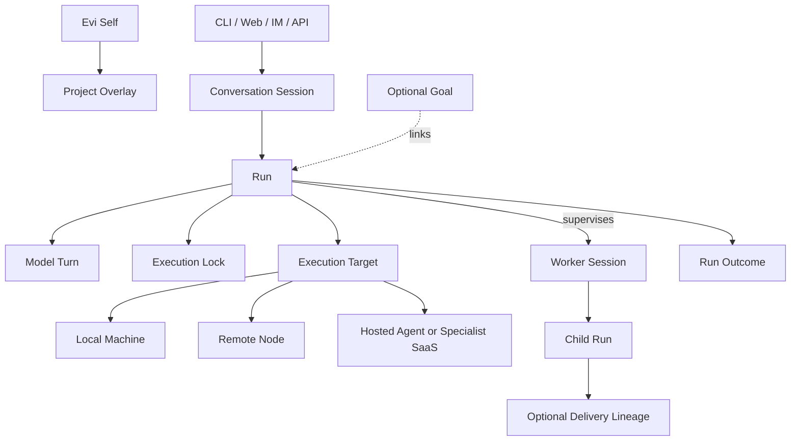

# Evi Product and Runtime Vision

Status: accepted long-term direction; not an implemented runtime contract or
an authorization to start every surface described here.

This document defines what Evi should grow into after its self-evolution and
self-iteration foundation is proven. It aligns one persistent self, many entry
surfaces, context-placed execution, parent-child orchestration, immutable
execution locks, memory, adaptation, tool competence, and the Evi/LuBan
boundary without turning them into a speculative backlog.

The Simplified Chinese companion is
[`docs/PRODUCT_VISION.cn.md`](PRODUCT_VISION.cn.md).

## Authority and Precedence

When this vision differs from current implementation, use this order:

1. Current code, [`docs/ARCHITECTURE.md`](ARCHITECTURE.md),
   [`docs/RUNTIME_CONTRACT.md`](RUNTIME_CONTRACT.md), and
   [`docs/LOCAL_RUNTIME.md`](LOCAL_RUNTIME.md) describe current placement and
   implemented behavior. Code and live evidence remain the final current-fact
   authority.
2. [`docs/V0.2_MULTI_NODE_EVOLUTION.md`](V0.2_MULTI_NODE_EVOLUTION.md) and
   accepted ADRs describe the accepted current delivery target.
3. This document describes the long-term product and runtime north star.
4. A bounded delivery slice, its Decision Owner, and the Runtime Kernel's
   execution and effect contracts activate actual work. GitHub may carry
   optional external collaboration or delivery evidence.

This vision alone does not prove completion, open an implementation slice, or
override a narrower acceptance, verification, privacy, or external-effect
gate.

## North Star

Evi should become a local-first general-agent brain: one durable, self-growing
Evi that can understand goals, operate across workspaces, learn how to use
tools and specialist agents well, choose an execution environment that matches
the task context, preserve continuity, and explain what happened with evidence.

The product shape is **one brain, many doors, and many execution
environments**. Evi may be invoked from a central console, IM mention, IDE,
browser, CLI, API, connector, or another host tool. Those surfaces bind context
to the same self; they do not create independent Evi personalities or state
owners.

It is not a separate personality for every workspace. Workspaces, goals,
sessions, and runs are scoped operating contexts around one persistent self.
It is also not another coding CLI, an uncontrolled agent-team chat room, or a
hosted multi-user control plane.

The product promise is:

> Give one trusted Evi durable goals, explicit context, verifiable execution,
> recoverable continuity, and a governed path to learn when, where, and how to
> use tools and specialist agents better.

## Product Principles

1. **One self, many scoped contexts.** Identity is stable; workspace, goal,
   session, and node overlays are explicit and inspectable.
2. **One logical brain, many physical doors.** Web, Desktop, IM mentions, IDEs,
   browsers, connectors, CLI, and APIs are bindings into the same Evi.
3. **Local self, context-placed execution.** The trusted local home is the
   default owner of self, goals, raw memory, and learning judgment. Work may run
   locally, near remote data, in a hosted agent, or inside a specialist SaaS.
4. **The runtime owns truth.** Every UI and host binding is a client of the
   resident runtime, never a second state owner.
5. **Context is compiled, not accumulated.** A model turn receives a bounded,
   immutable context snapshot selected for the current purpose.
6. **Execution is frozen before it starts.** Each Run Execution receives an
   immutable Execution Lock covering context, environment, selected actions,
   model, budgets, verification, and recovery. Pi `AgentHarness` executes that
   lock; it does not define Evi authority.
7. **Communication is typed.** Sessions exchange tasks, results, events, and
   artifact references instead of copying entire prompts or memory stores.
8. **Memory is not a message bus.** Operational coordination, historical
   recall, stable documentation, and reusable capability assets have different
   owners.
9. **Evi decides; LuBan preserves accepted assets.** Lifecycle judgment stays
   with Evi. LuBan provides canonical Git identity and history.
10. **Evidence before surface area.** More sessions, skills, connectors, and
    screens are not progress unless completion, recovery, and outcomes improve.

## Product Surfaces

All surfaces use one headless Evi Daemon/Gateway and its versioned contracts.

| Surface | Role | Boundary |
| --- | --- | --- |
| Evi Daemon/Gateway | Compose the Runtime Kernel, Action Gateway, Orchestration Engine, Adaptation Engine, context compilation, and canonical state | The only active runtime-state owner |
| Web Console/PWA | Primary operator workspace for goals, sessions, evidence, capabilities, nodes, and approvals | Does not implement a parallel runtime or planning database |
| Thin Desktop shell | Add tray presence, notifications, keychain, file pickers, OS permissions, and local computer-use integration | Reuses the daemon and Web UI; no second execution engine |
| IM adapters and mentions | Contextual invocation, conversation continuity, progress, and result delivery in the current work surface | Rich host context but no independent runtime state or control plane |
| Host bindings, connectors, and MCP-style adapters | Bring referenced host context and actions to Evi, or return artifacts to the host | Integration and execution surfaces; never a second self or memory owner |
| CLI/API | Diagnosis, automation, recovery, scripting, and contract-level access | Remains stable even when GUI surfaces change |

The Web Console should be the primary control and inspection surface because it
can express long-running goals, parallel sessions, evidence, capability growth,
and execution placement without duplicating operating-system integration. It is
not the sole task-entry surface. IM and host bindings may be deep contextual
doors into Evi as long as the runtime remains the state owner. A desktop shell
should be added only when native integration creates concrete value.

## Entry, Context, and Execution Placement

Product design must keep four questions separate:

1. where the operator invokes Evi;
2. where Evi's self, durable goals, memory, and learning judgment live;
3. where the task's authoritative context and credentials live;
4. where the work should execute.

Local-first means self sovereignty and a trusted default home, not forced
all-local computation. File organization and desktop use naturally execute on
the local machine. Remote development may execute next to the server checkout.
Long-running or webhook-driven work may continue on a resident remote node.
Connector and specialist-SaaS work may execute against cloud-owned data. A
mixed task may be planned and accepted by the home Evi while a remote or hosted
worker performs the bounded run.

Remote nodes, hosted agents, and specialist SaaS products are execution
environments or cognitive workers. They may hold a bounded checkpoint and task
context, but they do not become another Evi self. The parent Evi retains goal
continuity, result acceptance, outcome attribution, and capability learning.

## Runtime Domain Model



### Evi Self

The stable identity, values, learning stance, and global policy baseline. It is
not copied or forked when a workspace or session is created.

### Project Overlay

A persistent project or life-domain overlay. It binds repositories, local
paths, project instructions, policies, default capability sets, and semantic
memory scope. A Project Overlay does not own Evi's identity, Goal, or runtime
state.

### Goal

An optional durable intent that may span conversations and machines. It owns
only the accepted objective, success criteria, budget, continuation policy,
linked Runs, and terminal Goal outcome. Ordinary work does not require a Goal;
a Goal does not own sessions, tools, workers, worktrees, or the Agent Loop.

### Conversation Session

The continuity boundary between a person and Evi. Web, Desktop, IM, or API
bindings may point to the same session. A session owns recent conversation,
its checkpoint, selected working context, and its run history.

### Run

A durable execution attempt with explicit states such as `queued`, `running`,
`waiting`, `paused`, `completed`, `failed`, and `cancelled`. A Run binds Turns,
one immutable Execution Lock per execution attempt, selected context, execution
target, results, and completion evidence. A Run may be Goal-free.

### Model Turn

One model interaction inside a run. It is not the unit of durable ownership and
must not silently change the Run's Execution Lock or optional Goal.

### Worker Session

A parent-linked, isolated execution context for delegated work. It may use a
local worker, remote node, hosted agent, or specialist cognitive runtime. It has
a bounded Task Envelope, context references, narrowed Execution Lock, execution
binding, budget, and Result Envelope. Its output is advisory until the parent
Supervisor Run verifies and accepts it.

### Supervisor Run

A parent Run that owns decomposition, worker dispatch, integration, independent
verification, and final acceptance. It persists those decisions and returns
between events; it is not one continuously active planner-model request.

### Delivery Lineage

The isolated branch/worktree history for one source-mutating work item. It has
one active writer from baseline through verification and integration. A Goal may
link many Delivery Lineages, and a non-source Goal has none.

## Context Architecture

Every model turn receives an immutable Context Manifest. It is compiled from
references and policy, then stored with provenance, budget, selection reasons,
and omissions.

```text
Self Core
+ node and runtime identity
+ project overlay
+ optional goal summary and accepted decisions
+ session checkpoint and recent conversation
+ selected episodic or semantic recall
+ selected capabilities and asset locks
+ explicit Task or Result Envelope
+ referenced artifacts
+ Action contracts and result contract
= immutable context snapshot for one model turn
```

The context assembler shares definitions and references selectively. It must
not copy a sender's full raw prompt, transcript, tool output, or memory database
into another session.

| Context class | Default scope | Sharing rule |
| --- | --- | --- |
| Self core and global policy | Global | Read-only baseline, governed changes only |
| Project instructions and stable project docs | Project Overlay | Share by pinned reference within that project scope |
| Goal summary and accepted decisions | Optional Goal | Share only with Runs explicitly linked to the Goal |
| Session checkpoint and recent transcript | Session | Session-local unless explicitly summarized into a handoff |
| Working memory and raw tool output | Session or run | Never ambient cross-session context |
| Episodic and semantic memory | Global or workspace store | Retrieve on demand with source, scope, and confidence |
| Skill, prompt, SOP, and policy bodies | Capability selection | Load only selected, pinned versions |
| Artifacts | Referenced scope | Share immutable ref, hash, or commit before body materialization |

The current single working-checkpoint shape may eventually become a
session-scoped store plus a goal-level summary. That migration must preserve
existing evidence and recovery semantics; this document does not choose its
schema.

## Execution Lock Architecture

Evi does not define a second Agent Harness beside Pi. Pi `AgentHarness` owns the
model/tool loop and session mechanics. Evi owns the immutable Execution Lock
that tells the selected loop what it may do and how the result will be judged.
Under broad trusted local authority, that lock still preserves repeatability,
outcome attribution, completion truth, and recovery.

Every Run Execution freezes an immutable Execution Lock. At minimum it records:

- session, run, goal, node, model, and provider identity;
- tool allowlist and permission profile;
- selected capability versions and asset lock;
- project scope, repository, optional Delivery Lineage, and path policy;
- context, time, token, cost, retry, and output budgets;
- approval and external-effect gates;
- completion claims, verification contract, and rollback expectations.

Execution authority narrows through inheritance:

```text
Global baseline
  -> Workspace policy
    -> Session profile
      -> Run-specific clamp
```

A child session may only preserve or narrow parent authority. It cannot expand
permissions, install capabilities, change credentials, rewrite the receiver's
Execution Lock, or claim parent completion.

Live terminal handles, browser sessions, credentials, and mutable worktrees
must not be shared as raw objects between sessions. If concurrent work needs a
scarce resource, the runtime should issue a bounded, revocable resource lease
with owner, scope, expiry, and recovery behavior.

## Parent-Child Orchestration

Multi-session operation is necessary, but the default topology is a controlled
parent-child tree or task dependency graph, not a free peer-to-peer chat mesh.

The Evi-owned Orchestration Engine validates and advances a model-proposed task
graph. It owns durable worker state, dependencies, leases, budget reservations,
cancellation, `needs_input`, stale recovery, and result delivery. It does not
plan tasks, own an Agent Loop, or accept the parent Run.

A Supervisor Run may use a planner-oriented model to produce a bounded task
graph and then return. Resident state, rather than an open model request,
supervises workers. Worker, integration, and review turns are resumed by typed
events. Model selection is a recorded role policy: planner, integrator,
reviewer, and deep-discussion roles may prefer a stronger reasoning model;
executor roles may prefer a faster model. Model names are configuration, not
domain vocabulary, and fallback rationale is evidence.

A parent sends a `TaskEnvelope` containing:

- optional Goal, parent Run, and task identity;
- bounded objective and expected result;
- context and artifact references;
- constraints and narrowed Execution Lock;
- project, execution-target, and optional Delivery Lineage binding;
- verification requirements and deadline or budget.

A worker returns a `ResultEnvelope` containing:

- terminal or waiting status;
- summary and structured findings;
- artifact and changed-reference identities;
- verification evidence references;
- unresolved questions and proposed next step.

Inter-session messages must be marked as such, cannot impersonate the user,
cannot mutate the receiver's Execution Lock, and must carry state versioning.
The runtime bounds ping-pong depth, visibility, retries, fan-out, and total
budget. Discussion workers are non-blocking unless the parent explicitly makes
their result a dependency. Worker self-report never closes the parent Run.

## Memory, Documents, Events, and Artifacts

Memory or documents are not the primary mechanism for sessions to communicate.
Use the owner that matches the information's lifetime and effect:

| Information | Canonical mechanism |
| --- | --- |
| Progress, cancel, wait, completion, dependency change | Queue and state event |
| Subtask input and output | `TaskEnvelope` and `ResultEnvelope` |
| Current objective, decisions, and progress | Optional Goal summary, Supervisor Run state, and Session Checkpoint |
| Code, reports, images, datasets, generated files | Artifact ref plus hash or commit |
| Stable project rules and decisions | Project docs and accepted ADRs; optional GitHub evidence |
| Long-term personal or workspace facts | Semantic memory with provenance |
| Raw conversations and tool history | Session archive with on-demand search |
| Reusable way of working | Self Registry procedure version and optional LuBan asset |
| Cross-node accepted knowledge | Redacted, scoped LuBan knowledge pack |

The future memory model should preserve separate layers:

1. per-session working memory and checkpoint;
2. per-session episodic archive;
3. global or workspace semantic memory;
4. versioned procedural assets governed by the Adaptation Engine and optionally published through LuBan;
5. raw archive plus a separate search/index layer.

Recall remains selective. A memory's existence does not authorize automatic
injection into every session or model turn.

## Adaptation, Capability Views, and LuBan

The Adaptation Engine owns the durable-change lifecycle:

```text
evidence -> candidate -> evaluation -> activation
         -> observation -> revision, retirement, or rollback
```

Self-learning and self-evolution use this same lifecycle. They differ by target
and risk: learning changes retained knowledge, procedures, skills, or
evidence-backed tool-use competence; evolution changes prompts, tools, policy,
dependencies, source, runtime, or deployment. Candidate generators may use
verified episodes, bounded external discovery, or offline optimization, but no
generator may write the active Self Registry directly.

### Self Registry and capability infrastructure

The Self Registry records current and retired versions of identity, memory,
SOPs, Skills, prompts, capability profiles, policies, tools, and source
artifacts. Inventory, import, conflict detection, validation, activation
receipts, and recovery make those artifacts operable. The registry is not a
second runtime database or a manager that decides work; completing it does not
prove that Evi has learned.

### Capability views and tool competence

Evi must learn not only a procedure, but also when, where, and under which
conditions to use it. For each important tool, connector, specialist agent, or
execution environment, Evi should be able to accumulate evidence about:

- suitable task classes and required context;
- local, remote, hosted-agent, or SaaS placement;
- input preparation and output/verification contracts;
- observed quality, latency, cost, and failure modes;
- recovery, fallback, and tool-composition patterns;
- operator corrections and stable preferences;
- confidence, freshness, regression, revision, and retirement conditions.

Memory answers what Evi knows. A Skill or SOP describes how to perform a
repeatable procedure. A Tool Competence Model helps Evi decide when, where, and
with which tool or specialist agent to perform it. Capability growth requires
all three plus verified outcomes.

Capability inventory, readiness, competence, cost, risk, and fallback are
rebuildable decision views over Tool Contracts, active Self Registry versions,
and verified experience. Evi does not create a broad Capability Manager deep
module until a second owner would otherwise emerge. Each capability has one
default active provider; alternatives are explicitly fallback, experimental,
or retired rather than exposed through synonymous wrappers.

LuBan remains a private, Git-backed registry for accepted reusable assets. It
stores typed bodies, manifests, provenance, immutable history, and release
identity. It does not decide whether an asset should be used, install it on a
node, manage sessions, or own runtime state.

The sources of truth are deliberately different:

| Lifecycle state | Source of truth |
| --- | --- |
| Local observation, draft, or candidate | Evi node-local state and active vault |
| Accepted reusable version | Pinned LuBan commit and content hash |
| Selected and active version on a node | Evi asset lock and activation receipt |
| Actual quality and effect | Node-local outcome and verification evidence |

## State and Portability Direction

The accepted ownership model is:

- one SQLite database with WAL for canonical structured state, including Runs,
  Turns, executions, model dispatches, Goals, worker tasks, dependencies,
  reservations, receipts, adaptations, bindings, events, leases, and indexes;
- content-addressed immutable files for large context snapshots, evidence
  bodies, artifacts, and exported archives referenced from SQLite;
- Markdown and Git for stable project knowledge and decisions;
- LuBan for accepted reusable capability assets.

JSONL, directory scans, dashboards, and search indexes are projections,
fixtures, or archives rather than peer state authorities. vNext does not keep a
long-lived dual write with v0.2; each cutover replaces one complete owner and
keeps explicit export, recovery, and rollback evidence.

Evi's trusted local home is the default canonical owner of self identity,
durable goals, raw memory, and capability judgment. This does not require every
run to execute there. A session has one home node while active, while an
individual run may target a local environment, remote node, hosted agent, or
specialist SaaS. Cross-node session movement happens through pause, checkpoint,
export, handoff, and resume. Raw runtime databases and live handles are not
shared, and active-active execution of one session is not a goal.

## Operator Experience

The primary Web Console should eventually expose:

- Home: current attention, resident health, active Runs or optional Goals, and waiting actions;
- Workspaces: project bindings, policies, memory scope, and defaults;
- Goals: objective, criteria, ledger, dependencies, and outcomes;
- Sessions: status, channel bindings, parent/child topology, and recovery;
- Session Detail: Timeline, optional Goal/Checkpoint, Context Inspector,
  Execution Lock Inspector, Artifacts, Worker topology, and Evidence;
- Adaptation: candidates, evaluations, active Self Registry versions, LuBan
  proposals, receipts, observations, rollback, and retirement;
- Memory and Knowledge: scoped recall, provenance, contradictions, and promoted
  knowledge packs;
- Automations, Nodes, Approvals, and Settings.

The UI follows runtime contracts. A new read model may be exposed as soon as
its owner and evidence are stable, but the UI must not invent write semantics
that the CLI/API, Runtime Kernel, and Action Gateway do not have.

## Gated Evolution Policy

ADR 0012 closed the first five Kernel-foundation source slices on
`origin/develop`. The resident v0.2 runtime remains the deployed rollback
runtime until a separately verified cutover. The next sequence is deliberately
ordered:

1. **Read-only ingress canary.** Use an explicit opt-in command or endpoint,
   isolated SQLite state, and only `none/local_read` Actions. Do not mirror
   traffic, migrate v0.2 state, switch deployment, enable workers, or learn.
2. **Basic ingress and continuity.** Cut over one entry surface at a time to
   Goal-free Runs and durable session binding, then add the minimal optional
   Goal extension. Keep v0.2 rollback evidence until the cutover gate closes.
3. **Parent-child orchestration.** Add one asynchronous read-only discussion
   worker, then one execution worker, an independent reviewer, and finally
   bounded parallel workers with leases, hierarchical budgets, typed
   envelopes, and single-writer Delivery Lineages.
4. **Supervised self-learning.** Convert verified Episodes into inactive
   Memory, SOP, or Skill candidates; evaluate baseline versus candidate;
   activate by risk; observe real reuse; retire or roll back regressions.
5. **Active discovery and assimilation.** Treat GitHub, X, papers, news, and
   other trends as untrusted Discovery Signals. Match a real need, inspect
   trusted sources, extract tasks and tests, call/rewrite/discard, evaluate, and
   only then activate.
6. **Self-evolution.** Open Prompt, Tool, Policy, Dependency, Code, Runtime, and
   Deployment candidates only with isolated Delivery Lineage, regression
   cases, canary, Activation or Deployment Receipt, production observation,
   and executable rollback.

Only one feature-growth slice is active at a time unless their Decision Owners,
effect domains, state ownership, and Delivery Lineages are demonstrably
independent. This order is not a release promise. Measured evidence may narrow,
reorder, or retire a later candidate, but it may not silently skip the current
gate.

## Success Measures

Progress is measured by:

- verified goal completion and false-completion rate;
- context provenance, selectivity, and budget compliance;
- restart, recovery, rollback, and session handoff success;
- correct execution-target and tool selection, including successful fallback;
- outcome attribution quality across context, tool, environment, and procedure;
- Execution Lock violations prevented and external effects correctly gated;
- capability reuse outcomes, confidence calibration, regressions, and
  retirement quality;
- continuity when one task moves between central, IM, and host entry surfaces;
- cross-session result acceptance based on evidence rather than self-report;
- operator ability to understand current state and the next decision.

Counts of sessions, agents, skills, memory entries, screens, or tokens are not
success measures by themselves.

## Explicit Non-Goals Until the Gates Pass

- hosted multi-user control plane;
- public capability marketplace;
- raw memory or runtime-database synchronization;
- an independent Evi self for each surface, workspace, or execution node;
- forced all-local execution when context, availability, or data gravity favors
  a remote or hosted worker;
- free peer-to-peer session chat or autonomous ping-pong;
- active-active cross-node execution of one session;
- broad autonomous agent teams;
- a desktop monolith or separate desktop runtime;
- a shallow model/agent aggregator measured by provider, connector, or skill
  count;
- rebuilding every specialist editor or vertical SaaS inside Evi;
- GUI-first implementation that outruns runtime ownership and evidence;
- automatic global activation of LuBan assets;
- treating planning text as proof that a capability exists.

## Accepted Direction Summary

Evi grows as one persistent local-first self with many physical doors and
multiple execution environments. Four Evi-owned deep modules define the target:
Runtime Kernel, Action Gateway, Orchestration Engine, and Adaptation Engine.
Pi `AgentHarness`, behind one Evi-owned adapter, is the only Agent Loop and
remains replaceable without moving Goal, effect, result, or adaptation
ownership. A Goal is optional; a Supervisor Run coordinates typed Worker
Sessions; one source-mutating Delivery Lineage has one writer; specialized
receipts preserve distinct completion facts.

Central, IM, CLI, API, connector, and host-tool surfaces bind context to the
same Self. Local, remote, hosted-agent, and specialist-SaaS workers may execute
a Run without becoming another Evi or accepting the parent. Memory preserves
facts, Skills and SOPs preserve procedures, capability views guide selection,
the Self Registry records active versions, and LuBan preserves accepted
reusable assets in Git. The immediate next slice is the isolated read-only
ingress canary; it does not authorize orchestration, learning, migration, or
deployment cutover.
