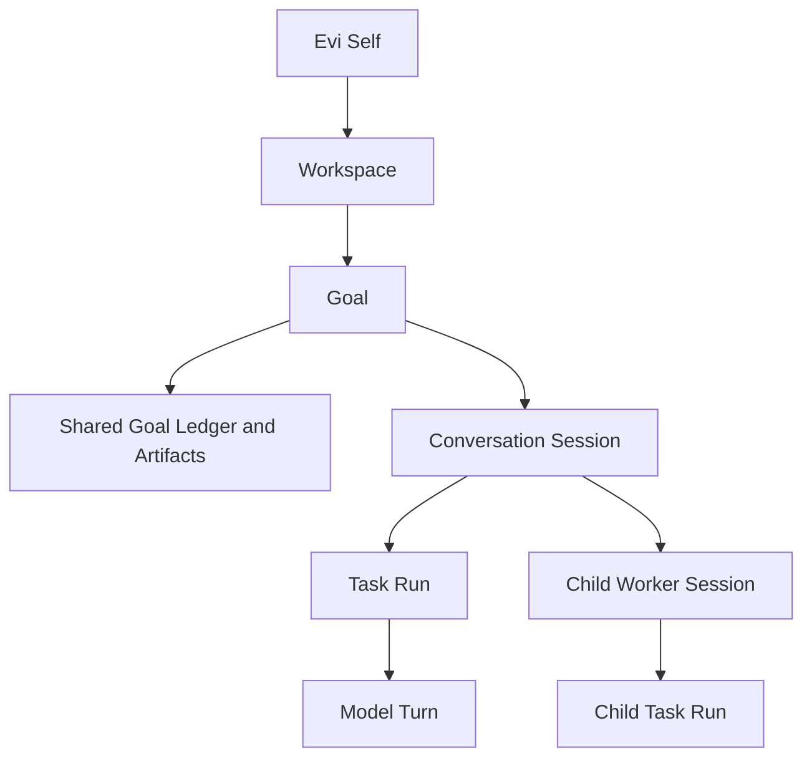

# Evi Product and Runtime Vision

Status: accepted long-term direction; not an implemented runtime contract or
an authorization to start every surface described here.

This document defines what Evi should grow into after its self-evolution and
self-iteration foundation is proven. It aligns product surfaces, multi-session
semantics, context, harness, memory, delegation, and the Evi/LuBan boundary
without turning them into a speculative backlog.

The Simplified Chinese companion is
[`docs/PRODUCT_VISION.cn.md`](PRODUCT_VISION.cn.md).

## Authority and Precedence

When this vision differs from current implementation, use this order:

1. Current code, [`docs/RUNTIME_CONTRACT.md`](RUNTIME_CONTRACT.md), and
   [`docs/LOCAL_RUNTIME.md`](LOCAL_RUNTIME.md) describe implemented behavior.
2. [`docs/V0.2_MULTI_NODE_EVOLUTION.md`](V0.2_MULTI_NODE_EVOLUTION.md) and the
   matching Trellis spec describe the accepted current delivery target.
3. This document describes the long-term product and runtime north star.
4. GitHub direction and one bounded Trellis task activate actual work.

This vision alone does not prove completion, open an implementation slice, or
override a narrower acceptance, verification, privacy, or external-effect
gate.

## North Star

Evi should become a local-first personal agent operating system: one durable,
self-growing Evi that can understand goals, operate across workspaces, execute
bounded work, preserve continuity, manage reusable capabilities, and explain
what happened with evidence.

It is not a separate personality for every workspace. Workspaces, goals,
sessions, and runs are scoped operating contexts around one persistent self.
It is also not another coding CLI, an uncontrolled agent-team chat room, or a
hosted multi-user control plane.

The product promise is:

> Give one trusted Evi durable goals, explicit context and authority, verifiable
> execution, recoverable continuity, and a governed path to learn and reuse
> better ways of working.

## Product Principles

1. **One self, many scoped contexts.** Identity is stable; workspace, goal,
   session, and node overlays are explicit and inspectable.
2. **The runtime owns truth.** Every UI is a client of the resident runtime,
   never a second state owner.
3. **Context is compiled, not accumulated.** A model turn receives a bounded,
   immutable context snapshot selected for the current purpose.
4. **Authority is frozen per run.** The harness records exactly what a run may
   use, change, spend, and claim.
5. **Communication is typed.** Sessions exchange tasks, results, events, and
   artifact references instead of copying entire prompts or memory stores.
6. **Memory is not a message bus.** Operational coordination, historical
   recall, stable documentation, and reusable capability assets have different
   owners.
7. **Evi decides; LuBan preserves accepted assets.** Lifecycle judgment stays
   with Evi. LuBan provides canonical Git identity and history.
8. **Evidence before surface area.** More sessions, skills, and screens are not
   progress unless completion, recovery, and outcomes improve.

## Product Surfaces

All surfaces use one headless Evi Daemon/Gateway and its versioned contracts.

| Surface | Role | Boundary |
| --- | --- | --- |
| Evi Daemon/Gateway | Own sessions, runs, queue, context assembly, harness, evidence, memory selection, and capability activation | The only active runtime-state owner |
| Web Console/PWA | Primary operator workspace for goals, sessions, evidence, capabilities, nodes, and approvals | Does not implement a parallel runtime or planning database |
| Thin Desktop shell | Add tray presence, notifications, keychain, file pickers, OS permissions, and local computer-use integration | Reuses the daemon and Web UI; no second execution engine |
| IM adapters | Fast task intake, progress, approval, and notification | Bounded commands and views; not the full control plane |
| CLI/API | Diagnosis, automation, recovery, scripting, and contract-level access | Remains stable even when GUI surfaces change |

The Web Console should be the primary product surface because it can express
long-running state, parallel sessions, evidence, and configuration without
duplicating operating-system integration. A desktop shell should be added only
when native integration creates concrete value.

## Runtime Domain Model



### Evi Self

The stable identity, values, learning stance, and global policy baseline. It is
not copied or forked when a workspace or session is created.

### Workspace

A persistent project or life-domain overlay. It binds repositories, local
paths, project instructions, policies, default capability sets, and semantic
memory scope. A workspace does not own Evi's identity.

### Goal

A durable objective that may span conversations and machines. It owns the
accepted objective, success criteria, current owner session, dependencies,
decisions, checkpoints, artifact references, and terminal outcome.

### Conversation Session

The continuity boundary between a person and Evi. Web, Desktop, IM, or API
bindings may point to the same session. A session owns recent conversation,
its checkpoint, selected working context, and its run history.

### Task Run

A durable execution attempt with explicit states such as `queued`, `running`,
`waiting`, `blocked`, `done`, `failed`, and `cancelled`. A run binds one context
snapshot, one harness lock, attempts, node, workspace/worktree, results, and
completion evidence.

### Model Turn

One model interaction inside a run. It is not the unit of durable ownership and
must not silently change the session's harness or goal.

### Worker Session

A parent-linked, isolated execution context for delegated work. It has a
bounded task, context, harness, workspace/worktree, and result contract. Its
output is advisory until the parent run verifies and accepts it.

## Context Architecture

Every model turn receives an immutable Context Manifest. It is compiled from
references and policy, then stored with provenance, budget, selection reasons,
and omissions.

```text
Self Core
+ node and runtime identity
+ workspace overlay
+ goal ledger
+ session checkpoint and recent conversation
+ selected episodic or semantic recall
+ selected capabilities and asset locks
+ explicit inter-session handoff
+ referenced artifacts
+ tool contract and output contract
= immutable context snapshot for one model turn
```

The context assembler shares definitions and references selectively. It must
not copy a sender's full raw prompt, transcript, tool output, or memory database
into another session.

| Context class | Default scope | Sharing rule |
| --- | --- | --- |
| Self core and global policy | Global | Read-only baseline, governed changes only |
| Workspace instructions and stable project docs | Workspace | Share by pinned reference within that workspace |
| Goal ledger and accepted decisions | Goal | Share with sessions attached to the goal |
| Session checkpoint and recent transcript | Session | Session-local unless explicitly summarized into a handoff |
| Working memory and raw tool output | Session or run | Never ambient cross-session context |
| Episodic and semantic memory | Global or workspace store | Retrieve on demand with source, scope, and confidence |
| Skill, prompt, SOP, and policy bodies | Capability selection | Load only selected, pinned versions |
| Artifacts | Referenced scope | Share immutable ref, hash, or commit before body materialization |

The current single working-checkpoint shape may eventually become a
session-scoped store plus a goal-level summary. That migration must preserve
existing evidence and recovery semantics; this document does not choose its
schema.

## Harness Architecture

Every Task Run freezes an immutable Harness Lock. At minimum it records:

- session, run, goal, node, model, and provider identity;
- tool allowlist and permission profile;
- selected capability versions and asset lock;
- workspace, repository, worktree, and path policy;
- context, time, token, cost, retry, and output budgets;
- approval and external-effect gates;
- completion claims, verification contract, and rollback expectations.

Harness policy narrows through inheritance:

```text
Global baseline
  -> Workspace policy
    -> Session profile
      -> Run-specific clamp
```

A child session may only preserve or narrow parent authority. It cannot expand
permissions, install capabilities, change credentials, rewrite the receiver's
harness, or claim parent completion.

Live terminal handles, browser sessions, credentials, and mutable worktrees
must not be shared as raw objects between sessions. If concurrent work needs a
scarce resource, the runtime should issue a bounded, revocable resource lease
with owner, scope, expiry, and recovery behavior.

## Inter-Session Coordination

Multi-session operation is necessary, but the default topology is a controlled
parent-child tree or task dependency graph, not a free peer-to-peer chat mesh.

Operational coordination uses a durable queue and typed state events, including
progress, pause, resume, cancel, `needs_input`, dependency completion, and
terminal state changes.

A parent sends a `TaskEnvelope` containing:

- goal and task identity;
- bounded objective and expected result;
- context and artifact references;
- constraints and harness profile;
- workspace/worktree binding;
- verification requirements and deadline or budget.

A worker returns a `ResultEnvelope` containing:

- terminal or waiting status;
- summary and structured findings;
- artifact and changed-reference identities;
- verification evidence references;
- unresolved questions and proposed next step.

Inter-session messages must be marked as such, cannot impersonate the user,
cannot mutate the receiver's harness, and must carry state versioning. The
runtime should bound ping-pong depth, visibility, retries, and total budget.

## Memory, Documents, Events, and Artifacts

Memory or documents are not the primary mechanism for sessions to communicate.
Use the owner that matches the information's lifetime and effect:

| Information | Canonical mechanism |
| --- | --- |
| Progress, cancel, wait, completion, dependency change | Queue and state event |
| Subtask input and output | `TaskEnvelope` and `ResultEnvelope` |
| Current objective, decisions, and progress | Goal Ledger and Session Checkpoint |
| Code, reports, images, datasets, generated files | Artifact ref plus hash or commit |
| Stable project rules and decisions | Project docs, GitHub Issue, and Trellis |
| Long-term personal or workspace facts | Semantic memory with provenance |
| Raw conversations and tool history | Session archive with on-demand search |
| Reusable way of working | Evi Capability Manager and LuBan asset |
| Cross-node accepted knowledge | Redacted, scoped LuBan knowledge pack |

The future memory model should preserve separate layers:

1. per-session working memory and checkpoint;
2. per-session episodic archive;
3. global or workspace semantic memory;
4. procedural capability assets managed by Evi and published through LuBan;
5. raw archive plus a separate search/index layer.

Recall remains selective. A memory's existence does not authorize automatic
injection into every session or model turn.

## Capability Manager and LuBan

Evi owns the full capability lifecycle:

```text
observe -> curate -> deduplicate -> audit -> test -> propose/publish
        -> select -> activate -> evaluate -> revise or retire -> rollback
```

The Capability Manager is an Evi product and runtime surface. It should absorb
the useful responsibilities previously associated with `skill-manager`:
inventory, source discovery, import, sync, conflict detection, backup, safe
projection, validation, and recovery. These are capabilities inside Evi, not a
separate authority beside it.

LuBan remains a private, Git-backed registry for accepted reusable assets. It
stores typed bodies, manifests, provenance, immutable history, and release
identity. It does not decide whether an asset should be used, install it on a
node, manage sessions, or own runtime state.

The sources of truth are deliberately different:

| Lifecycle state | Source of truth |
| --- | --- |
| Local observation, draft, or candidate | Evi node-local state and active vault |
| Accepted reusable version | Pinned LuBan commit and content hash |
| Selected and active version on a node | Evi asset lock and activation receipt |
| Actual quality and effect | Node-local outcome and verification evidence |

## State and Portability Direction

When the foundation is ready, the preferred ownership model is:

- SQLite with WAL for operational objects such as goals, sessions, runs,
  bindings, queue entries, dependencies, events, leases, approvals, and search
  metadata;
- filesystem JSON, JSONL, and immutable files for context snapshots, evidence,
  artifacts, and receipts;
- Markdown and Git for stable project knowledge and decisions;
- LuBan for accepted reusable capability assets.

This is a direction, not a mandate for a database rewrite. Each future slice
must migrate the smallest coherent owner and retain compatibility, export,
recovery, and rollback evidence.

A session has one home node while active. Cross-node movement happens through
pause, checkpoint, export, handoff, and resume. Raw runtime databases and live
handles are not shared, and active-active execution of one session is not a
goal.

## Operator Experience

The primary Web Console should eventually expose:

- Home: current attention, resident health, active goals, and waiting actions;
- Workspaces: project bindings, policies, memory scope, and defaults;
- Goals: objective, criteria, ledger, dependencies, and outcomes;
- Sessions: status, channel bindings, parent/child topology, and recovery;
- Session Detail: Timeline, Goal/Checkpoint, Context Inspector, Harness
  Inspector, Artifacts, Delegation, and Evidence;
- Capability Manager: candidates, installed/active sets, LuBan proposals,
  conflicts, receipts, outcomes, and retirement;
- Memory and Knowledge: scoped recall, provenance, contradictions, and promoted
  knowledge packs;
- Automations, Nodes, Approvals, and Settings.

The UI follows runtime contracts. A new read model may be exposed as soon as
its owner and evidence are stable, but the UI must not invent write semantics
that the CLI/API and harness do not have.

## Gated Evolution Policy

### Foundation gate: first priority

Do not start a broad Session Runtime, Capability Manager, Desktop, or new GUI
program until Evi proves its basic self-evolution and self-iteration loop:

1. select one bounded core/basic capability slice from an accepted goal;
2. compile bounded context with provenance, budget, and omission evidence;
3. execute only harness-authorized actions with explicit failure semantics;
4. bind completion claims to independent verification evidence;
5. persist outcome, checkpoint, rollback path, and the next decision point;
6. recover or restart the resident runtime with deployment identity and health
   aligned;
7. repeat the loop without unintended SOP, skill, memory, permission, or
   external-effect expansion.

Existing accepted v0.2 work continues until its own acceptance gate passes.
This vision must not leapfrog open v0.2 evidence, deployment, or knowledge-pack
gates.

### Goal selection after the gate

After the foundation and current target gates pass, choose exactly one bounded
goal at a time. The default dependency order is:

1. **Session Runtime Foundation**: durable goal/session/run ledger, context
   snapshot identity, harness lock, state transitions, restart, and recovery.
2. **Capability Manager MVP**: inventory, source identity, conflict checks,
   LuBan publish/select/activate receipts, outcome tracking, and rollback.
3. **Cognitive Continuity**: session-scoped working/episodic state, selective
   semantic recall, goal handoff, archive search, and context inspection.
4. **Delegated Execution**: typed parent-child sessions, queue/dependency
   control, resource leases, result acceptance, and budget limits.
5. **Product Layer Expansion**: progressively complete Web views, then add a
   thin Desktop shell only for proven native integration needs.

This order is not a release promise or fixed backlog. After each goal, Evi must
use measured evidence to keep, reorder, narrow, or retire the next candidate.
The active goal belongs in GitHub and one bounded Trellis task, not in this
document.

## Success Measures

Progress is measured by:

- verified goal completion and false-completion rate;
- context provenance, selectivity, and budget compliance;
- restart, recovery, rollback, and session handoff success;
- harness violations prevented and external effects correctly gated;
- capability reuse outcomes, regressions, and retirement quality;
- cross-session result acceptance based on evidence rather than self-report;
- operator ability to understand current state and the next decision.

Counts of sessions, agents, skills, memory entries, screens, or tokens are not
success measures by themselves.

## Explicit Non-Goals Until the Gates Pass

- hosted multi-user control plane;
- public capability marketplace;
- raw memory or runtime-database synchronization;
- free peer-to-peer session chat or autonomous ping-pong;
- active-active cross-node execution of one session;
- broad autonomous agent teams;
- a desktop monolith or separate desktop runtime;
- GUI-first implementation that outruns runtime ownership and evidence;
- automatic global activation of LuBan assets;
- treating planning text as proof that a capability exists.

## Accepted Direction Summary

Evi grows as one persistent self with multiple bounded operating contexts. Its
resident runtime owns goals, sessions, context, harness, execution, evidence,
memory selection, and capability lifecycle. Sessions coordinate through typed
runtime objects and references; memory and documents preserve knowledge rather
than acting as an implicit message bus. Evi manages capabilities, while LuBan
preserves accepted reusable assets in Git.

The immediate product decision is restraint: finish and prove the current
self-evolution foundation, close the accepted current target, then activate one
bounded goal at a time.
