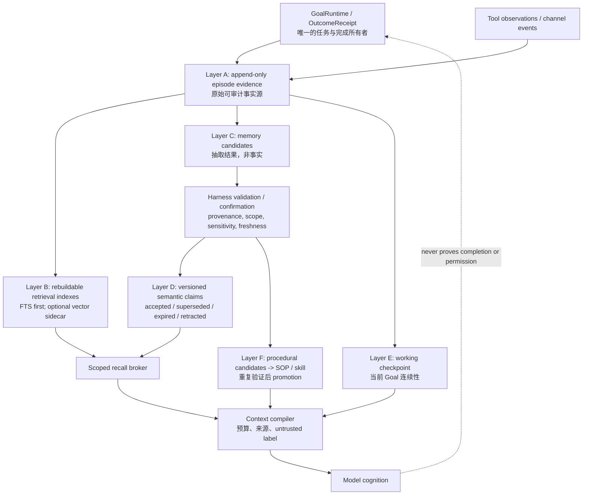

# Evi 记忆系统：开源方案对比与设计建议

> 调研日期：2026-07-19。本文优先使用各项目的官方仓库、官方文档和本地
> `Common/github_evi` 快照；不把项目自报 benchmark 当作跨项目性能结论。
> 本文是设计研究，不改变 Evi 的运行时行为或任何外部配置。

## 结论先行

Evi 不应接入一个“替代其记忆系统”的通用 memory service。它已经拥有更适合
本地自成长运行时的正确核心：**append-only episode evidence、Goal/Outcome 的
明确所有权、候选记忆与确认边界、以及 procedural memory 的 promotion gate**。

真正的缺口是把该核心补为一个可测量的**记忆平面**：

1. 让原始证据与任何检索索引严格分离；
2. 为语义记忆加上 version、scope、freshness、supersession 和 retirement；
3. 在不改变 GoalRuntime / EffectPolicy 所有权的前提下，提供 scoped hybrid recall；
4. 把每一次 recall 作为带来源和不确定性的 *untrusted evidence context*，而不是
   指令、权限或完成证明；
5. 先用真实 Evi trace 建立 recall、误召回、安全和行为收益的评测，再决定是否引入
   向量、图或外部 sidecar。

换言之，Evi 的目标应是 **evidence-backed memory with bounded recall**，不是
“尽量记住一切”的聊天档案，也不是“让模型自由改写自己的长期记忆”。

## Evi 当前基础与真实差距

`core/memory.md` 已定义 Resident / Working / Episodic / Semantic / Procedural
五层，并要求 durable memory 具有 scope、source、evidence、confidence 与
freshness；也明确规定 raw session 不是自动长期记忆。其实现已经把 episode
JSONL 作为证据源、把 SQLite FTS 作为可重建索引，并限制 raw artifacts 不进入
常规上下文：

- `packages/core/src/memory_store.ts`：episode JSONL -> SQLite FTS 的可重建索引；
- `packages/runtime/src/runner.ts`：live recall 只给 context bundle 事件摘要、分数与
  artifact refs；
- `packages/runtime/src/memory_candidates.ts`：`propose_memory` 先写 candidate，
  acceptance 经 confirmation 才生成 accepted semantic memory；
- `packages/core/src/working_checkpoints.ts`：进度连续性与 durable fact 分离；
- `packages/core/src/recall.ts`：procedural skill 的 outcome-aware ranking；
- `packages/core/src/memory_layers.ts`：明确 resident context、按需 episode recall 和
  diagnostic-only layer 的 token 边界。

但当前 live episode recall 主要是词项匹配；文档也明确 MemoryStore 不是 vector
或 hybrid search。accepted semantic memory 的实现对象尚没有统一的 `version`、
`supersedes`、有效期/复核时间、撤回原因和可查询的 namespace contract。因此下一步
应优先补齐这些契约与评测，而不是先堆叠更多存储技术。

## 市场主流路线

| 路线 | 核心思想 | 代表 | 最适用的情形 | 对 Evi 的判断 |
| --- | --- | --- | --- | --- |
| 文件优先的分层记忆 | 小型常驻索引 + 文件化长期事实/日记 + 按需读取 | GenericAgent、OpenClaw | 单机 coding agent、可人工审阅知识 | 应保留；Evi 已有更严谨的 evidence 版本 |
| 记忆数据层 / hybrid retrieval | LLM 抽取记忆，向量、关键词、元数据共同召回 | Mem0、agentmemory、MemOS | 大量跨会话个性化或语义改写查询 | 只取 scoped retrieval sidecar，不交出事实写入权 |
| 会话连续性与压缩 | JSONL 会话树、compact summary、branch summary | pi、Codex | 长 task 的上下文容量管理 | Evi 应继续用 checkpoint / receipt，不另造 session owner |
| 可插拔 provider | 统一 lifecycle，允许一个外部 memory provider | Hermes | 多后端试验、不同部署环境 | 可采纳小接口与“一次仅一个 provider”约束 |
| temporal / graph memory | entity-edge、时间有效性、provenance、多跳检索 | Graphiti/Zep、MemoryBear、MemOS Tree | 事实随时间变化且关系查询本身是产品需求 | 不是当前优先级；先证明普通 hybrid recall 不够 |
| 虚拟上下文 / stateful agent | 模型用 memory tools 管理有限上下文与长期 state | Letta（MemGPT） | 面向用户的长期 stateful agent | 借鉴 context budget；不让模型直接拥有 Evi 的事实权威 |
| hot-path learning API | agent 在 task 中主动 store/search，后台抽取和 prompt 优化 | LangMem | 已采用 LangGraph 的应用 | 可参考 API 分类；不引入其框架依赖 |

## 各项目对比

| 系统 | 实际设计 | 可以吸收 | 不应照搬到 Evi |
| --- | --- | --- | --- |
| **GenericAgent (GA)** | L1（<=30 行索引）-> L2 全局事实 -> L3 SOP/脚本 -> L4 历史会话归档；模型按 SOP 更新文件。 | 极小 resident index、事实与 procedure 分层、经验沉淀为 SOP。 | 模型直接 patch 记忆；L4 压缩/删除原始会话；缺少可执行 scope、version、证据与撤回契约。 |
| **OpenClaw** | `MEMORY.md` 是精选长期层，daily notes 是工作层；Markdown 为事实源，SQLite/FTS/可选向量为可重建索引；预压缩 flush 与可选 Dreaming promotion。 | source/index 分离；长期层小而可审阅；recall 结果标为 untrusted context；Dreaming 的分阶段 gate。 | 用 memory 保存政策但不执行政策这一点必须保留；不要把 active-memory 的阻塞子 agent 变成 Evi 所有 task 的隐式延迟。 |
| **Hermes** | `MemoryProvider` 约定 initialize、prefetch、sync_turn、session end、pre-compress 等 lifecycle，并限制同时一个外部 provider。 | `MemoryRecallPort` / provider lifecycle；单 provider 防止 tool/schema 膨胀；prefetch 不能阻塞主 loop。 | provider 不得拥有 Evi 的 Goal、receipt、semantic acceptance 或 effect decision。 |
| **pi** | 每个 cwd 的 JSONL session tree；会话 fork/branch，结构化 compaction 和 branch summary 追踪文件读写。 | session/branch summary 应明确 Goal、约束、决策、下一步与读改文件；摘要是可丢弃 read model。 | 它不是跨 session durable memory；不应和 Evi GoalRuntime / checkpoint 形成第二套任务真相。 |
| **Codex** | 官方文档描述：本地 memory files，排除活动/短会话，后台异步抽取、秘密脱敏，并执行 per-chat extraction + global consolidation；可按 chat 控制 use/generate。 | 两阶段异步管线、idle/配额 gate、secret redaction、文件为 generated state；硬规则仍应放 `AGENTS.md` / checked-in docs。 | 把 memory 当强制 repo 规则；把其宿主实现当成 Evi 兼容 API。 |
| **agentmemory** | hooks 捕获 session/prompt/tool/failure/subagent 观测；压缩为 observation；BM25 + vector + graph 检索；`Memory` 有 version、supersedes、source observation、project/agent scope、TTL/forget。 | 可选 hybrid index、query/token/access telemetry、project/agent fail-closed filter、supersession 与 tombstone 模式。 | 53-tool/MCP/hook control plane；自动 consolidation/词面“冲突”删除；把 Evi transcript 直接送入另一个系统；无 secret 的 REST 暴露。 |
| **MemOS** | 可插拔 Naive/General/Preference/Tree/KV-cache/Parametric modules；一般文本记忆由 LLM 抽取、embedding、vector DB 和 metadata 组成。 | `TextualMemoryItem` 的 metadata 思路：type、source、time、confidence、entities、visibility、updated_at。 | 为当前单机 Evi 同时引入 graph DB、vector DB、KV cache、parametric memory 的产品面。 |
| **MemoryBear** | graph-first：抽取 triples、Neo4j、keyword+vector、强度/时间衰减、周期 reflection/forgetting。 | 事实关系、temporal validity、从衰减 recall rank 而非删除原始事实开始。 | 多服务基础设施和“自动判断矛盾/遗忘”为事实真相；其自报效果不能替代 Evi eval。 |
| **Mem0** | 面向 user / session / agent 的记忆 API；通过 LLM 从输入抽取、向量化并检索，可用托管或自托管后端。 | namespace 设计、API 级 add/search 的可替换性、独立 memory benchmark 的意识。 | 在 Evi 先拥有 provenance / governance 之前，把 `add()` 当事实写入。 |
| **Letta / MemGPT** | agent 通过 tools 自管理 core/archival memory，把有限 prompt 当虚拟内存；当前 Letta 也主张 Git-backed memory repository。 | 把 context budget 作为一等约束；长期状态须可审计与可版本化。 | 由 agent 自行编辑 core memory 即可成立的假设；Evi 不能把 effect/identity 边界降为 prompt discipline。 |
| **LangMem** | storage-agnostic primitives；支持 hot-path 由 agent 管理 memory，和 background extraction / prompt optimization。 | 区分“本轮主动 query”的 API 与“后台生成 candidate”的 API。 | 绑定 LangGraph 或让一次 task 成功自动变成 durable learning。 |
| **Graphiti / Zep** | episode 是 provenance；从 episode 增量构建实体、关系和时间有效区间，semantic + keyword + graph traversal。 | 有效时间、记录时间、source episode、历史查询的表示。 | 在没有明确多跳/时态查询需求前构建 graph；它会显著放大 extraction、ontology 和一致性维护成本。 |

项目原始资料见文末链接。对于 GA、Hermes、OpenClaw、pi、MemOS、MemoryBear、
agentmemory 与 Codex，同时核对了本机 `Common/github_evi` 中的源码快照；其 commit
仅用于本次审计，不能代表长期上游版本。

## 推荐目标架构



### 1. 数据与所有权

- **Layer A 是唯一可追溯事实源。** episode、tool observation、verification、receipt
  继续 append-only。索引、summary、embedding、graph 都是可重建 projection。
- **Working state 不升级为知识。** 当前 Goal 的限制、下一步和阻塞仍只在 checkpoint；
  completion 只由 OutcomeReceipt/verification 证明。
- **Semantic claim 是有状态的派生物。** 不应只有一段 Markdown，而应保留如下最小
  metadata：

```ts
type SemanticClaim = {
  id: string;
  kind: "preference" | "fact" | "decision" | "constraint" | "pitfall";
  content: string;
  scope: { node: string; operator?: string; repo?: string; channel?: string; goal?: string };
  sourceRefs: string[];              // episode / file / receipt / operator input
  evidenceClass: "operator" | "verified" | "reported" | "inferred";
  confidence: "low" | "medium" | "high";
  validFrom?: string; validUntil?: string; recordedAt: string;
  reviewAfter?: string; sensitivity: "public" | "private" | "restricted";
  status: "candidate" | "accepted" | "superseded" | "expired" | "retracted";
  supersedes?: string[]; retirementReason?: string;
};
```

`confidence` 不是权限；`sourceRefs` 不是自动验证；`accepted` 也不是当前外部世界
仍然为真的声明。

### 2. 读取与注入

读取应由一个没有写权限的 `MemoryRecallPort` 统一完成：

1. Context compiler 先装入 resident self、当前 Goal、working checkpoint 和显式 task
   references；
2. 由 repo/node/channel/agent/goal namespace **fail closed** 过滤可查询 corpus；
3. lexical FTS 先召回；只有已有评测证明 query rewrites 值得时，才并行一个可选 embedding
   sidecar；随后做 freshness、evidence class、recency、diversity/MMR 的 rerank；
4. 为模型渲染极少量的 claim/episode 摘要，并逐条给出 `memory_ref`、source refs、
   scope、freshness 和 “untrusted recalled evidence” 标签；
5. 如果模型拟基于 stale/high-impact memory 做 effect，必须重新读取权威 source 或执行
   有界 verification，而不是相信 recall。

这保留了 OpenClaw/agentmemory 的 hybrid retrieval 优点，又不会让向量命中绕过 Evi
的 evidence 和 effect harness。

### 3. 写入、升级与遗忘

- 原始 observation 在主路径写入；candidate extraction、embedding 和 consolidation
  均在后台、可重试且有工作量上限。
- 提升到 semantic claim 前校验 schema、source 存在性、namespace、敏感数据、重复项、
  freshness 和 source-of-truth 冲突；高影响/推断型候选保留 confirmation gate。
- 用 `superseded` / `retracted` tombstone 替代静默覆写或删除。被淘汰的是 prompt
  eligibility 和 rank，不是 evidence ledger。
- `expired` 只表示“再次引用前要核验”；不能把时间衰减误当作事实已经为假。
- Dream/reflection 只能提出 candidate 与评测任务。它不能写 active vault、改变
  identity、执行 backlog、确认 completion，正好延续 Evi 现有的约束。

### 4. 安全边界

- 记忆内容与检索结果是数据而不是指令；在 prompt 中使用明确的 fenced/untrusted 区。
- 每个 state root、operator、repo、channel、agent 必须是显式 namespace；缺失 namespace
  时拒绝跨域召回，不能默认 global。
- 清洗 secret、token、cookie、私密 PII；保存敏感内容前还要有 sensitivity policy，不能
  只依赖 regex redaction。
- Memory system 永远不拥有 approval、sandbox、effect policy、Goal acceptance 或
  completion verdict。
- 外部 provider 的默认能力应为 read-only；只允许一个 provider，且把 network、MCP
  hooks、导入/export 与 Evi evidence ledger 分开审计。

## 对 agentmemory 的具体决定

agentmemory 值得作为 **隔离实验的检索 sidecar**，不应成为 Evi 的主记忆或默认
hook/MCP 控制面。其最有价值的部分是 typed observation、版本/`supersedes`、
project-agent filter、hybrid search、retention telemetry 和审计；最大风险是它会同时
捕获、压缩、巩固和遗忘，恰好与 Evi 的 episode、Goal、semantic candidate、skill
promotion 形成重复所有权。

若要试验，限制为：

1. 从 Evi 已脱敏的 episode *summary* 单向导入，且每条都保留原 Evi `artifact_ref`；
2. 仅调用 search，结果走 `MemoryRecallPort` 再由 Context compiler 标记为 untrusted；
3. 禁止其 hooks 自动捕获 Evi、禁止 `remember/consolidate/forget` 回写、禁止它决定
   `accepted`/skill promotion；
4. 仅 loopback、显式认证、独立 state root、可完整 export/rebuild；
5. 以离线 fixture 对比 Evi FTS vs FTS+sidecar 的 scoped recall、误召回、p95 latency 和
   token budget。没有显著行为收益就移除 sidecar。

## 分阶段建议与验收

| 阶段 | 交付 | 必须通过的证据 |
| --- | --- | --- |
| 0：基线 | 从真实、脱敏 Evi traces 选取记忆 eval fixture；记录现有 FTS 命中、上下文 token、召回来源。 | scope leak=0；fixture 可离线复跑。 |
| 1：claim contract | 给 candidate/accepted claim 加 status、scope、source lineage、freshness、supersedes/retract。 | schema migration、readback、tombstone 与过期测试。 |
| 2：recall broker | FTS scoped recall、固定 budget、provenance render、high-impact reverify contract。 | unrelated recall 不注入；每一条均能追到 source ref。 |
| 3：hybrid sidecar | 可关、可重建、shadow-mode embedding/hybrid rerank。 | 相对 FTS 的 recall/precision/latency 行为收益，且无 scope/safety 回归。 |
| 4：procedure feedback | 将 verified repeated reuse 作为 SOP/skill promotion 的独立信号。 | 未验证成功、单次成功、失败/过期 skill 都不能自动 promotion。 |
| 5：graph（条件化） | 只在时态、多跳、实体关系查询是重复真实需求时做。 | 与 hybrid baseline 对照；每 edge 可回溯 episode，支持 supersession。 |

评估不能只测 R@K。至少还需要：

- **retrieval correctness**：正确 source 是否被召回、错误同名/近义 source 是否被排除；
- **temporal correctness**：旧 decision 被 supersede 后不会以 current fact 注入；
- **scope/privacy**：不同 repo/node/channel/agent 不交叉泄漏；
- **memory-write quality**：candidate 是否真实可由 evidence 支持，是否错误把 working state
  升级为 durable fact；
- **behavioral value**：召回是否让同一修复/计划/工具选择更正确，而非只提高相似度；
- **safety**：retrieved prompt injection、secret/PII、memory-derived effect 和 completion claim
  均被拒绝或要求核验；
- **operational cost**：token、p95、索引 freshness、失败可恢复性和 background quota。

## 资料（官方一手来源）

- Evi：[`core/memory.md`](../../core/memory.md)、[`docs/LOCAL_LEARNING.md`](../LOCAL_LEARNING.md)、
  [`MemoryStore`](../../packages/core/src/memory_store.ts)、
  [`memory candidates`](../../packages/runtime/src/memory_candidates.ts)。
- [GenericAgent memory SOP](https://github.com/lsdefine/GenericAgent/blob/main/memory/memory_management_sop.md)
  与 [agent loop / global-memory injection](https://github.com/lsdefine/GenericAgent/blob/main/ga.py)。
- [OpenClaw memory overview](https://github.com/openclaw/openclaw/blob/main/docs/concepts/memory.md)、
  [memory search](https://github.com/openclaw/openclaw/blob/main/docs/concepts/memory-search.md)、
  [active memory](https://github.com/openclaw/openclaw/blob/main/docs/concepts/active-memory.md)。
- [Hermes `MemoryProvider`](https://github.com/NousResearch/hermes-agent/blob/main/agent/memory_provider.py)
  与 [MemoryManager](https://github.com/NousResearch/hermes-agent/blob/main/agent/memory_manager.py)。
- [pi sessions](https://github.com/earendil-works/pi-mono/blob/main/packages/coding-agent/docs/sessions.md)
  与 [compaction](https://github.com/earendil-works/pi-mono/blob/main/packages/coding-agent/docs/compaction.md)。
- [Codex local memories 官方文档](https://learn.chatgpt.com/docs/customization/memories)。
- [agentmemory](https://github.com/rohitg00/agentmemory)、
  [`Memory`/observation data types](https://github.com/rohitg00/agentmemory/blob/main/src/types.ts)、
  [smart search](https://github.com/rohitg00/agentmemory/blob/main/src/functions/smart-search.ts)。
- [MemOS memory module overview](https://github.com/MemTensor/MemOS/blob/main/docs/en/open_source/modules/memories/overview.md)
  与 [first textual memory](https://github.com/MemTensor/MemOS/blob/main/docs/en/open_source/getting_started/your_first_memory.md)。
- [MemoryBear](https://github.com/SuanmoSuanyangTechnology/MemoryBear)。
- [Mem0](https://github.com/mem0ai/mem0)、[Letta](https://github.com/letta-ai/letta)、
  [LangMem](https://github.com/langchain-ai/langmem)、
  [Graphiti](https://github.com/getzep/graphiti)。
